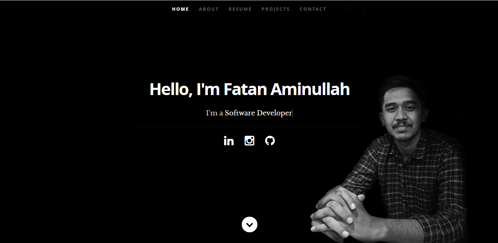

# Personal Portfolio Website



This is my personal portfolio website created using ReactJS. You can check it out here: [**https://fatanaminullah.com**](https://fatanaminullah.com)

## Run Project

### 1. Clone the project

### 2. Run the project

#### with yarn

```shell
yarn install
yarn start
```

#### with npm

```shell
npm install
npm start
```

## Credits

I'm using react resume template by [Timbakerdev](https://github.com/tbakerx/react-resume-template)
